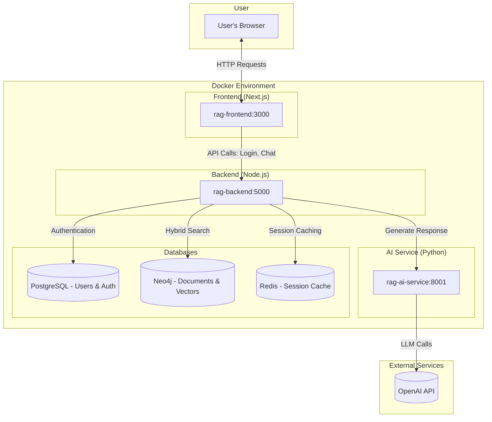

# Travelers RAG System

This project implements a full-stack, enterprise-grade **Retrieval-Augmented Generation (RAG)** system designed for intelligent document querying. It features a Next.js frontend, a Node.js backend, a Python AI service, and a dual-database architecture using Neo4j for GraphRAG and PostgreSQL for robust user authentication and authorization.

> **Note on Inspiration**  
> The idea for developing this system originated as preparation for a job interview with **Travelers Insurance Company**. While the project is not affiliated with or endorsed by Travelers, the interview process motivated the design and implementation of an enterprise-ready RAG solution with security, scalability, and real-world use cases in mind.

## About The Project

The Travelers RAG System provides a secure, multi-user chat interface where users can ask natural language questions about ingested documents. Unlike simple RAG systems, this project is built with enterprise features in mind:

*   **Graph-Based Knowledge:** Uses **Neo4j** to store document chunks and their embeddings, enabling powerful vector similarity searches and laying the groundwork for complex graph-based queries.
*   **Secure Authentication:** Implements a complete authentication and authorization system with **PostgreSQL**, managing users, roles, and permissions. This ensures that users can only access information they are permitted to see.
*   **Advanced RAG Pipeline:** The **Node.js backend** orchestrates a sophisticated RAG pipeline that includes query preprocessing, hybrid search (vector + keyword), and permission-based filtering of retrieved chunks.
*   **Conversational AI:** A dedicated **Python AI service** using FastAPI and LangChain handles prompt engineering, context management, and response generation, providing conversational continuity and awareness.
*   **Containerized Architecture:** The entire application is containerized with **Docker Compose**, allowing for a consistent, one-command setup across different environments.

This repository serves as a comprehensive blueprint for building production-ready RAG applications that go beyond simple prototypes, incorporating critical features like security, session management, and multi-tenancy.

## Features

*   **Full-Stack Application:** Modern, responsive chat interface built with Next.js and Tailwind CSS.
*   **Secure User Management:** Robust authentication and Role-Based Access Control (RBAC) powered by Node.js, JWT, and PostgreSQL.
*   **Hybrid Search:** Combines vector similarity search and full-text keyword search in Neo4j for optimal retrieval accuracy.
*   **Permission-Aware Retrieval:** Filters retrieved document chunks based on the logged-in user's role and departmental access rights.
*   **Conversational Memory:** Maintains session history to understand follow-up questions and provide contextually relevant answers.
*   **Document Ingestion:** A secure API endpoint for administrators to ingest, chunk, and embed new documents into the knowledge base.
*   **Containerized & Reproducible:** Fully dockerized services for easy setup, deployment, and scalability.

## Architecture

The system is composed of several independent services that communicate over a shared Docker network, ensuring a clean separation of concerns.



### Directory Structure
```plaintext
.
├── Dockerfile.ai
├── Dockerfile.backend
├── Dockerfile.frontend
├── ai_service.py               # Python/FastAPI service for LLM generation
├── docker-compose.yml          # Orchestrates all services
├── init-scripts/               # PostgreSQL schema and sample data
│   ├── 01-init-auth-schema.sql
│   └── 02-init-sample-data.sql
├── rag-backend/                # Node.js/Express backend
│   ├── auth/                   # Authentication logic, middleware, and routes
│   ├── server.js               # Main API server and RAG orchestration
│   └── package.json
└── rag-frontend/               # Next.js frontend
    ├── app/                    # Main application pages (chat, login)
    ├── public/
    └── package.json
```

## Technology Stack

*   **Frontend:** Next.js, React, Tailwind CSS
*   **Backend:** Node.js, Express.js
*   **AI Service:** Python, FastAPI, LangChain, OpenAI
*   **Databases:**
    *   **PostgreSQL:** User authentication, roles, permissions, audit logs.
    *   **Neo4j:** Document chunks, vector embeddings, graph relationships.
    *   **Redis:** Session storage and caching.
*   **Containerization:** Docker, Docker Compose

## Getting Started

Follow these instructions to get the project running locally.

### Prerequisites

*   Docker and Docker Compose
*   Git
*   An OpenAI API Key

### Installation & Setup

1.  **Clone the repository:**
    ```sh
    git clone https://github.com/matusalemcassim/TravelersRAGSystem.git
    cd TravelersRAGSystem
    ```

2.  **Create an environment file:**
    Create a file named `.env` in the root of the project and add your secrets. The Node.js backend and Python AI service will both use this file.

    ```env
    # For Python AI Service (ai_service.py)
    OPENAI_API_KEY="sk-..."
    LANGCHAIN_API_KEY="your-langsmith-api-key"   # Optional, for tracing
    LANGCHAIN_PROJECT="Travelers ChatBot"      # Optional, for tracing

    # For Node.js Backend (rag-backend/server.js)
    JWT_SECRET="a-very-strong-and-long-secret-key-for-jwt"
    SESSION_SECRET="another-strong-and-long-secret-key-for-sessions"
    ```

3.  **Build and run the services:**
    Use Docker Compose to build the images and start all the containers.
    ```sh
    docker-compose up --build -d
    ```
    This command will start the frontend, backend, AI service, Neo4j, PostgreSQL, pgAdmin, and Redis containers.

4.  **Access the application:**
    *   **Frontend:** [http://localhost:3000](http://localhost:3000)
    *   **Backend API:** [http://localhost:5000](http://localhost:5000)
    *   **Neo4j Browser:** [http://localhost:7474](http://localhost:7474) (Credentials: `neo4j` / `password`)
    *   **pgAdmin:** [http://localhost:8080](http://localhost:8080) (Credentials: `matusalemcassim@gmail.com` / `admin123`)

### Usage

1.  **Login:**
    Navigate to the login page at [http://localhost:3000/login](http://localhost:3000/login). You can use one of the pre-configured demo accounts. To ingest documents, you must log in as an administrator.
    *   **Username:** `admin`
    *   **Password:** `password123`

2.  **Ingest a Document:**
    Before you can chat, you need to add knowledge to the system.
    *   After logging in as `admin`, click the **Document Ingestion** tab.
    *   Copy the contents of the `info.txt` file provided in the repository.
    *   Paste the text into the text area and click **Ingest Document**.
    *   You should see a success message confirming the document was chunked and added to Neo4j.

3.  **Start Chatting:**
    *   Navigate back to the **Chat Interface** tab.
    *   Ask questions related to the ingested document, such as:
        *   `How long has Travelers been around?`
        *   `What was the total charitable support in 2023?`
        *   `When did The St. Paul and Travelers merge?`
        *   `Who is the title sponsor of the PGA TOUR event?`

## API Endpoints

The backend exposes several API endpoints for handling authentication and RAG operations.

| Method | Endpoint                    | Description                                                           | Authentication |
| :----- | :-------------------------- | :-------------------------------------------------------------------- | :------------- |
| `POST` | `/api/auth/login`             | Authenticates a user and returns a JWT.                               | Public         |
| `POST` | `/api/auth/logout`            | Logs out the user and invalidates the session.                        | Required       |
| `GET`  | `/api/auth/me`                | Returns information about the currently authenticated user.           | Required       |
| `GET`  | `/api/auth/verify`            | Verifies if the current JWT is valid.                                 | Required       |
| `POST` | `/api/ingest`                 | Ingests, chunks, and embeds a document.                               | Admin Only     |
| `POST` | `/api/retrieve`               | Sends a question to the RAG pipeline and returns a generated answer.  | Optional       |
| `POST` | `/api/clear-session`          | Clears the conversation history for a given session ID.               | Optional       |
| `GET`  | `/api/conversation/:sessionId`| Retrieves the message history for a specific conversation.            | Optional       |
| `GET`  | `/api/health`                 | Health check endpoint for the backend service.                        | Public         |
